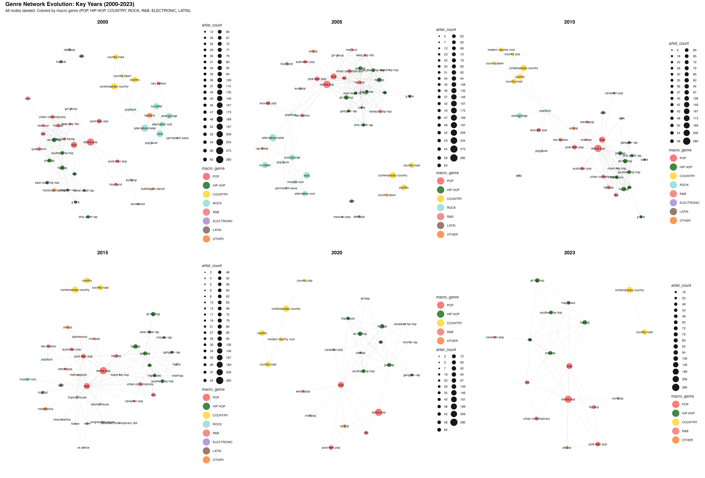
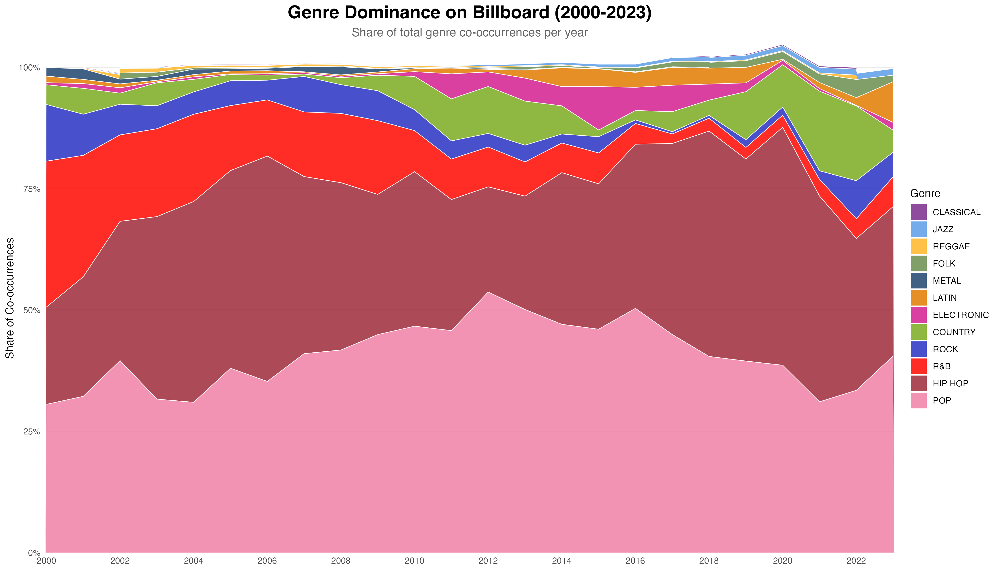
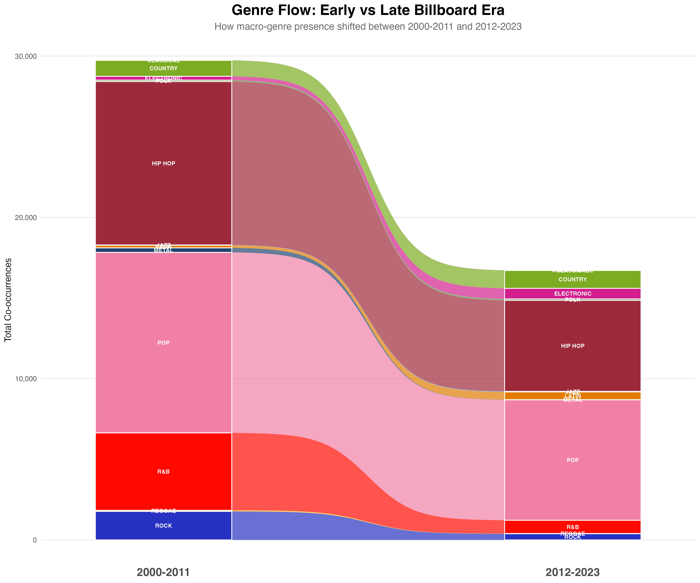
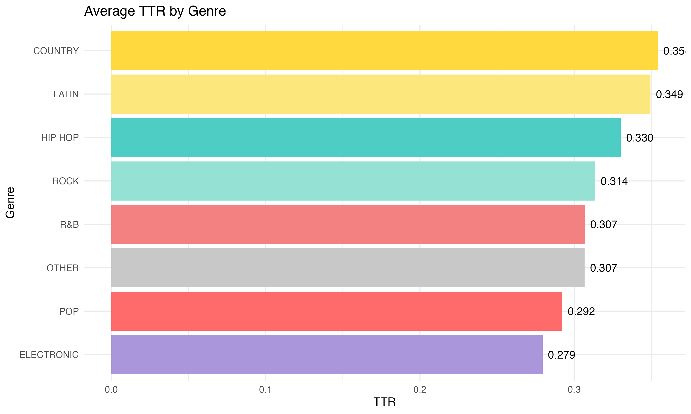
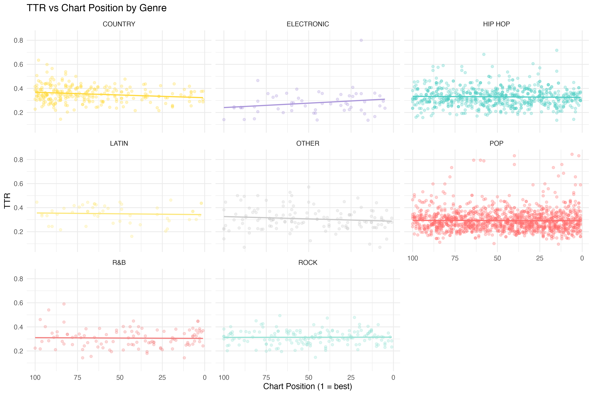
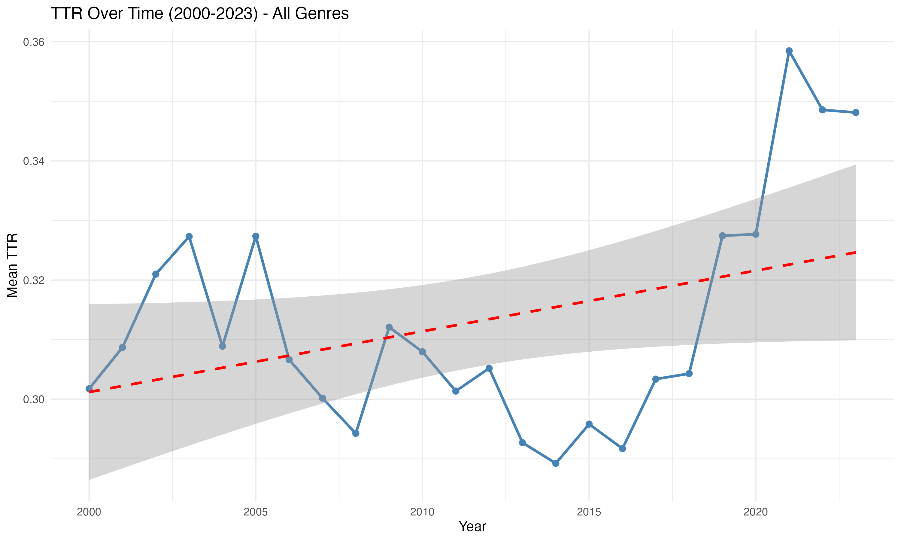

# Billboard Lyrics Analysis (2000-2023)

Analysis of Billboard Hot 100 songs focusing on lexical diversity and genre network evolution.

## Research Questions

### 1. How does lexical diversity in song lyrics relate to chart performance and vary across genres in Billboard Hot 100 songs (2000-2023)?

| Analysis Type | Method |
|---------------|--------|
| Descriptive statistics | Mean, median, distribution of TTR/density by genre |
| Correlation analysis | Spearman's rho (lexical metrics vs chart position) |
| Comparative analysis | Cross-genre metric comparisons |
| Time series analysis | Temporal trends across 24 years |
| Text mining | Tokenization, word frequency, Jaccard similarity |

### 2. How do genre relationships evolve over time in the Billboard Top 100?

| Analysis Type | Method |
|---------------|--------|
| Network analysis | Co-occurrence matrix via one-mode projection (G = AᵀA) |
| Graph metrics | Degree centrality, strength, betweenness |
| Temporal analysis | 24 yearly network snapshots with "pop" anchored at center |
| Visualization | Force-directed layout (Fruchterman-Reingold) with collision detection |
| Clustering | Macro genre grouping (16 categories) |
| Animation | Flipbook-style yearly snapshots for temporal evolution |

## Dataset

| Source | Records | Description |
|--------|---------|-------------|
| Billboard Hot 100 (Kaggle) | 3,397 songs | Chart rankings, lyrics, Spotify features |
| MusicoSet (DSW 2019) | 11,518 artists | Genre classifications, metadata |

**Coverage:**
- Lyrics: 100%
- Genre data: 85.6%
- Spotify features: 14%

### Sampling Method

**Purposive/criterion sampling** (non-probability)

- **Population**: All music released 2000-2023
- **Sample**: Songs appearing on Billboard Hot 100
- **Criterion**: Commercial chart success

**Represents**: Mainstream/popular music, commercial hits, radio/streaming promoted content

**Does not represent**: Underground/indie music, album deep cuts, regional/niche genres, non-charting music

## Data Pipeline

### Source Datasets

```
BILLBOARD (Kaggle)                         MUSICOSET (DSW 2019)
billboard_24years_lyrics_spotify.csv       musicoset_metadata/artists.csv
─────────────────────────────────────      ────────────────────────────────
Columns:                                   Columns:
• ranking (1-100)                          • artist_id
• song                                     • name
• band_singer                              • followers
• year (2000-2023)                         • popularity
• lyrics                                   • artist_type
• uri                                      • main_genre        ◄── GENRE SOURCE
• danceability, energy, etc (Spotify)      • genres (array)    ◄── SUB-GENRES
                                           • image_url
Records: 3,397 songs                       Records: 11,518 artists
```

### Data Joins

```
═══════════════════════════════════════════════════════════════════════════════════════

LEXICAL ANALYSIS (lexical_diversity_transformation.ipynb)

  billboard_improved.csv        musicoset_artists_cleaned.csv
  ┌─────────────────────┐       ┌─────────────────────────────┐
  │ song                │       │ name                        │
  │ band_singer    ─────┼──JOIN─┼─► main_genre                │
  │ year                │  ON   │   genres (array)            │
  │ lyrics              │ artist│                             │
  │ ranking             │       │                             │
  └─────────────────────┘       └─────────────────────────────┘
            │
            ▼
  ┌─────────────────────────────────────────────────────────────┐
  │ billboard_lexical_analysis_ready.csv                        │
  ├─────────────────────────────────────────────────────────────┤
  │ FROM BILLBOARD:        │ FROM MUSICOSET:  │ CALCULATED:     │
  │ • song                 │ • main_genre     │ • ttr           │
  │ • band_singer          │                  │ • lexical_density│
  │ • year                 │ MAPPED:          │ • hapax_ratio   │
  │ • ranking              │ • macro_genre    │ • rare_word_ratio│
  │ • lyrics               │   (via mapping)  │ • jaccard_*     │
  └─────────────────────────────────────────────────────────────┘

═══════════════════════════════════════════════════════════════════════════════════════

BIGQUERY (bigquery_analysis_queries.sql)

  billboard_bigquery.csv        musicoset_artists_cleaned.csv
  ┌─────────────────────┐       ┌─────────────────────────────┐
  │ band_singer    ─────┼──JOIN─┼─► name                      │
  │ year                │  ON   │   main_genre                │
  │                     │ artist│   genres (array unpacked)   │
  └─────────────────────┘       └─────────────────────────────┘
            │
            ▼
  ┌─────────────────────────────────────────────────────────────┐
  │ QUERY 2: Genre Co-Occurrence Network                        │
  │ Self-join on artist to create genre pairs:                  │
  │ Artist "Post Malone" has genres: [pop, hip hop, rap]        │
  │   → Creates edges: pop↔hip hop, pop↔rap, hip hop↔rap        │
  │                                                             │
  │ Output: genre_1, genre_2, co_occurrence_count               │
  └─────────────────────────────────────────────────────────────┘

═══════════════════════════════════════════════════════════════════════════════════════

GENRE NETWORK (genre_analysis.ipynb)

  QUERY 2 output              QUERY 5 output           genre_macro_mapping.csv
  ┌───────────────────┐       ┌─────────────────┐      ┌──────────────────────┐
  │ genre_1           │       │ sub_genre       │      │ micro_genre          │
  │ genre_2           │       │ primary_main_   │      │ macro_genre          │
  │ co_occurrence_    │       │ genre           │      │ (16 categories)      │
  │ count             │       │ artist_count    │      │                      │
  └─────────┬─────────┘       └────────┬────────┘      └──────────┬───────────┘
            │                          │                          │
            └──────────────────────────┴──────────────────────────┘
                                       │
                                       ▼
                    ┌──────────────────────────────────────┐
                    │ Network graph with:                  │
                    │ • Nodes = sub-genres (957)           │
                    │ • Node color = macro_genre           │
                    │ • Node size = artist_count           │
                    │ • Edges = co_occurrence_count        │
                    └──────────────────────────────────────┘

═══════════════════════════════════════════════════════════════════════════════════════
```

### Processing Pipeline

```
┌─────────────────────────────────────────────────────────────────────────────────────┐
│                                 RAW DATA SOURCES                                     │
│                                                                                      │
│   Billboard Hot 100 (Kaggle)              MusicoSet (DSW 2019)                       │
│   ┌─────────────────────────┐             ┌─────────────────────────┐               │
│   │ billboard_24years_      │             │ musicoset_metadata/     │               │
│   │ lyrics_spotify.csv      │             │ ├── artists.csv         │               │
│   │ • 3,397 songs           │             │ └── songs.csv           │               │
│   │ • Lyrics, rankings      │             │                         │               │
│   │ • Spotify features      │             │ musicoset_songfeatures/ │               │
│   └───────────┬─────────────┘             │ └── lyrics.csv          │               │
│               │                           └───────────┬─────────────┘               │
└───────────────┼───────────────────────────────────────┼─────────────────────────────┘
                │                                       │
                ▼                                       ▼
┌─────────────────────────────────────────────────────────────────────────────────────┐
│                              STAGE 1: CLEANING (R)                                   │
│                                                                                      │
│   billboard_cleaning.ipynb                musicoset_cleaning.ipynb                   │
│   • Normalize whitespace                  • Convert "-" & "[]" to NA                 │
│   • Single-line lyrics                    • Tab → CSV format                         │
│               │                                       │                              │
│               ▼                                       ▼                              │
│   ┌─────────────────────────┐             ┌─────────────────────────┐               │
│   │ billboard_bigquery.csv  │             │ musicoset_artists_      │               │
│   │ (3,397 songs)           │             │ cleaned.csv (11,518)    │               │
│   └───────────┬─────────────┘             └───────────┬─────────────┘               │
└───────────────┼───────────────────────────────────────┼─────────────────────────────┘
                │                                       │
                ▼                                       │
┌─────────────────────────────────────────────────────────────────────────────────────┐
│                         STAGE 2: LYRICS IMPROVEMENT (R)                              │
│                                                                                      │
│   billboard_cleaning.ipynb (Stage 2)     ◄────────────┘                              │
│   • Match outliers with MusicoSet by song+artist                                     │
│   • Replace 564 problematic lyrics                                                   │
│               │                                                                      │
│               ▼                                                                      │
│   ┌─────────────────────────┐                                                       │
│   │ billboard_improved.csv  │                                                       │
│   │ (3,649 songs)           │                                                       │
│   └───────────┬─────────────┘                                                       │
└───────────────┼─────────────────────────────────────────────────────────────────────┘
                │
      ┌─────────┴─────────────────────────────┐
      │                                       │
      ▼                                       ▼
┌─────────────────────────┐     ┌─────────────────────────────────────────────────────┐
│    BIGQUERY PATH        │     │              LEXICAL ANALYSIS PATH                   │
│                         │     │                                                      │
│  Upload:                │     │  lexical_diversity_transformation.ipynb              │
│  • Billboard            │     │  + musicoset_artists_cleaned.csv                     │
│  • MusicoSet            │     │  + common_english_words_10k.csv                      │
│          │              │     │              │                                       │
│          ▼              │     │              ▼                                       │
│  bigquery_queries.sql   │     │  ┌─────────────────────────────┐                    │
│          │              │     │  │ billboard_lexical_analysis_ │                    │
│          ▼              │     │  │ ready.csv                   │                    │
│  sql_query_out/         │     │  │ • 37 columns                │                    │
│  ├── QUERY 2 (network)  │     │  │ • Lexical metrics           │                    │
│  ├── QUERY 4 (yearly)   │     │  │ • Genre data                │                    │
│  └── QUERY 5 (mapping)  │     │  └─────────────┬───────────────┘                    │
│          │              │     │                │                                     │
└──────────┼──────────────┘     │                ▼                                     │
           │                    │  lexical_analysis.ipynb → outputs/lexical_analysis/ │
           │                    └─────────────────────────────────────────────────────┘
           │
           ▼
┌─────────────────────────────────────────────────────────────────────────────────────┐
│                         STAGE 3: GENRE NETWORK (R)                                   │
│                                                                                      │
│   genre_analysis.ipynb                                                               │
│   + QUERY 2 output (edges)                                                           │
│   + QUERY 5 output (node metadata)                                                   │
│   + genre_macro_mapping.csv (manual 16-category mapping)                             │
│               │                                                                      │
│               ▼                                                                      │
│   outputs/genre_network/                                                             │
│   ├── genre_network_full.png                                                         │
│   ├── genre_network_evolution_key_years.png                                          │
│   ├── genre_hubs.png                                                                 │
│   └── genre_snapshots_yearly/ (24 files)                                             │
└─────────────────────────────────────────────────────────────────────────────────────┘
```

### Sub-Genre Extraction

```
musicoset_artists_cleaned.csv contains:
  genres column = array of sub-genres per artist
  Example: "['dance pop', 'pop', 'post-teen pop']"

BigQuery UNNEST() unpacks this array:
  Artist: "Ariana Grande"
  genres: "['dance pop', 'pop', 'post-teen pop']"
    ↓ UNNEST
  Row 1: artist="Ariana Grande", genre="dance pop"
  Row 2: artist="Ariana Grande", genre="pop"
  Row 3: artist="Ariana Grande", genre="post-teen pop"
```

### Macro Genre Mapping

1,560 micro-genres mapped to 16 categories:

POP, HIP HOP, ROCK, METAL, JAZZ, BLUES, FOLK, R&B, COUNTRY, LATIN, ELECTRONIC, CLASSICAL, REGGAE, NEW AGE, AVANT-GARDE, OTHER

### How Genre Relationships Are Derived

The genre network edges represent **how many artists share both genres**, not collaborations between artists. This is a one-mode projection of a bipartite network (artist-genre → genre-genre).

#### Source Data

| Dataset | Key Fields | Purpose |
|---------|------------|---------|
| **Billboard** | `band_singer`, `year` | Which artists charted in which year (temporal filter) |
| **MusicoSet Artists** | `name`, `main_genre`, `genres` | Genre tags per artist (from Spotify API) |

**Important**: The `songs.csv` is NOT used for the genre network. Relationships are based on genre co-occurrence within artists, not song collaborations.

#### Transformation Steps (BigQuery Query 2)

```
Step 1: Explode artist genres
─────────────────────────────
Artist "112" has genres: ['atl hip hop', 'boy band', 'dance pop', 'hip hop', ...]

This becomes multiple rows:
  112 → atl hip hop
  112 → boy band
  112 → dance pop
  112 → hip hop
  ...

Step 2: Self-join on artist (G = Aᵀ × A)
────────────────────────────────────────
For artist "112", create ALL genre pairs:
  (atl hip hop, boy band)      ← same artist has both
  (atl hip hop, dance pop)     ← same artist has both
  (atl hip hop, hip hop)       ← same artist has both
  (boy band, dance pop)        ← same artist has both
  ...

Step 3: Count distinct artists per genre pair
─────────────────────────────────────────────
  hip hop ↔ rap: 287 artists have BOTH tags
  pop rap ↔ rap: 273 artists have BOTH tags
  dance pop ↔ pop: 268 artists have BOTH tags
```

#### Temporal Filtering (Query 3/4)

For yearly networks, Billboard adds the time component:

```
Billboard (year=2023) → Filter to artists who charted in 2023
                      → Join with MusicoSet genres
                      → Run same genre-pair algorithm
                      → Result: Genre network for 2023 only
```

#### Key Insight

Two genres are connected if many artists are tagged with **both** genre labels by Spotify. Example: "hip hop" and "rap" are strongly connected because 287 artists have both tags.

### Co-occurrence Decline Over Time

The genre network analysis reveals a significant **67% decline in total co-occurrences** from 2000 to 2023. This decline is NOT due to fewer artists on Billboard, but rather to data coverage limitations.

#### Root Causes

| Factor | Explanation | Impact |
|--------|-------------|--------|
| **MusicoSet Coverage Gap** | MusicoSet dataset is from 2019, so artists who became popular after 2019 have no genre data | ~40% of recent artists unmatched |
| **Fewer Genre Tags Per Artist** | Even matched artists in recent years tend to have fewer genre tags on average | Reduces possible co-occurrence pairs |
| **Spotify API Genre Sparsity** | Newer/smaller artists often have fewer genre tags in Spotify's database | Compounds the coverage issue |

#### Interpretation Note

When analyzing temporal trends in the genre network, the declining co-occurrences should be interpreted as a **data artifact** rather than a real decrease in genre diversity or cross-genre collaboration. The early period (2000-2011) has more complete data coverage than the later period (2012-2023).

### Data Enhancement Pipeline

To mitigate the MusicoSet coverage gap, a supplementary data pipeline was implemented:

```
┌─────────────────────────────────────────────────────────────────────────────┐
│                     DATA ENHANCEMENT PIPELINE                                │
├─────────────────────────────────────────────────────────────────────────────┤
│                                                                              │
│  Step 1: Identify Coverage Gap                                               │
│  ─────────────────────────────                                               │
│  • Compare Billboard artists with MusicoSet                                  │
│  • Found: ~600 artists with no genre data (mostly post-2019)                 │
│                                                                              │
│  Step 2: Spotify API Fetch                                                   │
│  ─────────────────────────                                                   │
│  • Used spotifyr R package with client credentials                           │
│  • Fetched genres for unmatched artists                                      │
│  • Result: ~400 artists matched via Spotify                                  │
│                                                                              │
│  Step 3: Manual Assignment                                                   │
│  ────────────────────────                                                    │
│  • High-frequency artists with no Spotify genres                             │
│  • Manually assigned based on known artist style                             │
│  • Result: ~50 additional artists with genres                                │
│                                                                              │
│  Step 4: Merge & Recalculate                                                 │
│  ───────────────────────────                                                 │
│  • Priority: Manual > Spotify > MusicoSet                                    │
│  • Recalculate co-occurrences with enhanced data                             │
│  • Result: Improved coverage for 2019-2023 period                            │
│                                                                              │
└─────────────────────────────────────────────────────────────────────────────┘
```

**Files created:**
- `supplementary_artist_genres_final.csv` - Combined Spotify + manual genres
- `edges_enhanced.csv` - Co-occurrence network with enhanced data
- `temporal_edges_enhanced.csv` - Yearly co-occurrences with enhanced data

## Installation

### R Packages

```r
# Core
install.packages(c("tidyverse", "readr", "stringr", "ggplot2"))

# Missing data
install.packages(c("naniar", "visdat"))

# Text mining
install.packages("tidytext")

# Network analysis
install.packages(c("igraph", "ggraph", "GGally", "network", "sna", "intergraph", "patchwork"))

# Animation
install.packages("gganimate")

# Sankey/alluvial diagrams
install.packages("ggalluvial")
```

### BigQuery (Optional)

1. Create BigQuery project and dataset
2. Upload cleaned CSVs
3. Update table references in `bigquery_analysis_queries.sql`

## Project Structure

```
data/
├── cleaned/                              # Processed datasets
│   ├── billboard_lexical_analysis_ready.csv
│   ├── genre_macro_mapping.csv
│   ├── musicoset_artists_cleaned.csv
│   ├── musicoset_songs_cleaned.csv
│   ├── supplementary_artist_genres_final.csv  # Enhanced genre data
│   ├── edges_enhanced.csv                     # Enhanced co-occurrence network
│   └── temporal_edges_enhanced.csv            # Enhanced yearly co-occurrences
├── sql_query_out/                        # BigQuery results
└── [raw data files]

wrangling and transformation/
├── cleaning/                             # Data cleaning notebooks
│   ├── billboard_cleaning.ipynb
│   ├── musicoset_cleaning.ipynb
│   └── BILLBOARD_CSV_CLEANING_DOCUMENTATION.md
└── wrangling/                            # Transformation notebooks
    ├── lexical_diversity_transformation.ipynb
    ├── bigquery_analysis_queries.sql
    └── genre_collaboration_network_documentation.md

analysis and vizualisation/
└── analysis/
    ├── lexical_analysis.ipynb
    ├── genre_analysis.ipynb
    └── ANALYSIS_GUIDE.md

outputs/
├── genre_network/                        # Network visualizations
│   ├── genre_network_full.png
│   ├── genre_network_evolution_key_years.png
│   ├── genre_network_animated.gif
│   ├── genre_hubs.png
│   ├── genre_dominance_over_time.png
│   ├── genre_flow_sankey.png
│   ├── genre_cooccurrence_change.png
│   ├── unique_artists_over_time.png
│   ├── cooccurrence_drop_investigation.png
│   └── genre_snapshots_yearly/
└── lexical_analysis/                     # Lexical analysis outputs
```

## Outputs

### Lexical Analysis

**Metrics calculated:**

| Metric | Formula | What It Measures |
|--------|---------|------------------|
| **Type-Token Ratio (TTR)** | unique words / total words | Vocabulary variety within a song |
| **Lexical Density** | content words / total words | Information density (nouns, verbs vs filler) |
| **Rare Word Ratio** | words not in top 10k / unique words | Creative/unusual vocabulary usage |
| **Compression Ratio** | gzip size / original size | Algorithmic repetitiveness measure |
| **Jaccard Genre** | song ∩ genre / song ∪ genre | How typical for its genre |
| **Jaccard Corpus** | song ∩ Billboard / song ∪ Billboard | How mainstream the vocabulary is |
| **Jaccard Common** | song ∩ common / song ∪ common | Everyday language usage |

**Visualizations:**

| Output | Description |
|--------|-------------|
| `01_ttr_by_genre.png` | TTR distribution boxplots by macro-genre |
| `02_avg_ttr_by_genre.png` | Average TTR ranking by genre |
| `03_ttr_vs_chart_position.png` | Scatter plot of TTR vs Billboard ranking |
| `04_creative_vocab_vs_chart.png` | Rare word ratio vs chart position |
| `05_compression_by_genre.png` | Compression ratio by genre |
| `06_compression_over_time.png` | Temporal trend of compression ratio |
| `07_rare_words_by_genre.png` | Rare word usage by genre |
| `09_ttr_over_time.png` | Overall TTR trends 2000-2023 |
| `10_ttr_over_time_by_genre.png` | TTR trends by genre |
| `14_lexical_density_by_genre.png` | Lexical density by genre |
| `16_genre_vs_mainstream.png` | 2D space: genre-typical vs mainstream |
| `17_vocab_homogeneity_over_time.png` | Vocabulary convergence trends |

#### Issues Encountered

| Issue | Description | Solution |
|-------|-------------|----------|
| **Latin genre inflation** | Spanish words flagged as "rare" since they're not in English word list | Acknowledged as limitation; Latin scores artificially high on rare word metrics |
| **Stop word filtering** | Code-switching lyrics (Spanish/English) don't filter properly | Used English stop words only; noted in limitations |
| **Song length bias** | Longer songs have lower TTR due to word repetition | TTR normalizes by design, but noted for interpretation |
| **Pre-2010 lyrics quality** | Some older lyrics had formatting/encoding issues | 564 problematic lyrics replaced from MusicoSet |
| **Genre assignment level** | Genres assigned at artist level, not song level | A pop artist's ballad still labeled as "pop" |

### Genre Network

**Network Statistics:**
- **957 nodes** (sub-genres)
- **8,597 edges** (co-occurrence connections)
- **24 yearly snapshots** (2000-2023) with "pop" anchored at center

**Visualizations:**
| Output | Description |
|--------|-------------|
| `genre_network_full.png` | Complete network with Fruchterman-Reingold layout |
| `genre_network_evolution_key_years.png` | 4-panel comparison (2000, 2008, 2016, 2023) |
| `genre_network_animated.gif` | Animated evolution across all years |
| `genre_hubs.png` | Central connector genres by betweenness centrality |
| `genre_dominance_over_time.png` | Stacked area chart of macro-genre presence |
| `genre_flow_sankey.png` | Sankey diagram comparing early vs late Billboard eras |
| `genre_cooccurrence_change.png` | Biggest rise/drop in co-occurrence |
| `unique_artists_over_time.png` | Billboard artist count by year |
| `avg_genre_tags_per_artist.png` | Genre tag coverage over time |
| `cooccurrence_drop_investigation.png` | Root cause analysis of co-occurrence decline |
| `data_enhancement_impact.png` | Original vs enhanced data comparison |

## Limitations

| Limitation | Description | Impact |
|------------|-------------|--------|
| **Sampling Bias** | Only Billboard Hot 100 songs included | Results represent mainstream/commercial music only, not the full music landscape |
| **MusicoSet Temporal Gap** | Dataset from 2019 | Artists popular after 2019 have limited/no genre coverage despite data enhancement |
| **Genre Tag Inconsistency** | Spotify genre tags vary in granularity | Some artists have 10+ tags, others have 1-2, affecting co-occurrence calculations |
| **Single Chart Focus** | Only US Billboard Hot 100 | Does not capture regional charts, international trends, or genre-specific charts |
| **Lyrics Availability** | Some songs have incomplete/missing lyrics | May affect lexical diversity metrics for certain songs |
| **Feature Artist Handling** | Collaborations credited to primary artist | May undercount cross-genre collaborations |

## Data Sources

1. **Billboard Hot 100 (2000-2023)** - [Kaggle](https://www.kaggle.com/datasets/suparnabiswas/billboard-hot-1002000-2023-data-with-features)
2. **MusicoSet** - [DSW 2019](https://marianaossilva.github.io/DSW2019)

## References

### Academic

- Park, M., et al. (2019). Global music streaming data reveal cross-cultural correlations. *Frontiers in Psychology*, 10, 1873.
- Newman, M. E. J. (2001). Scientific collaboration networks. *Physical Review E*, 64(1).
- Barabási, A. L. (2016). *Network Science*. Cambridge University Press.

See `genre_collaboration_network_documentation.md` for complete bibliography.

### R Packages & Tools

- **igraph** - Network analysis in R: [Documentation](https://igraph.org/r/)
- **ggraph** - Grammar of graphics for networks: [Documentation](https://ggraph.data-imaginist.com/)
- **gganimate** - Animation framework for ggplot2: [Documentation](https://gganimate.com/)
- **ggalluvial** - Alluvial/Sankey diagrams: [Documentation](https://corybrunson.github.io/ggalluvial/)
- **tidyverse** - Data manipulation and visualization: [Documentation](https://www.tidyverse.org/)

## Visualization Gallery

### Genre Network


*Genre co-occurrence network at key years (2000, 2008, 2016, 2023)*


*Macro-genre presence on Billboard across 24 years*


*Genre flow between early (2000-2011) and late (2012-2023) Billboard eras*

### Lexical Analysis


*Vocabulary variety by genre - Country and Hip-Hop highest, Pop and Electronic lowest*


*No correlation between vocabulary diversity and chart success*


*Vocabulary variety trends 2000-2023*

## Author

**Lorenzo Garduño**

All analysis logic, methodology, and bulk of the code written by Lorenzo Garduño. Claude Code was used to assist with coding implementation and debugging.

