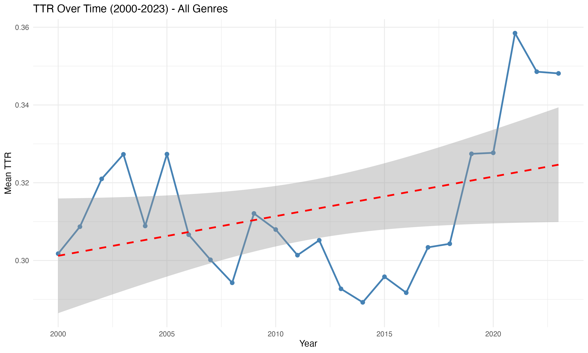
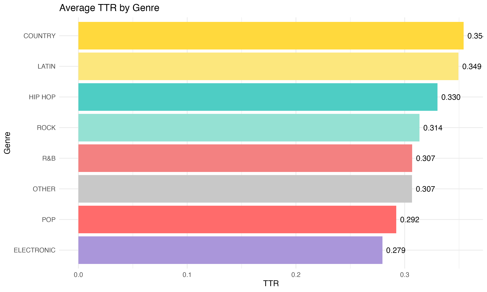
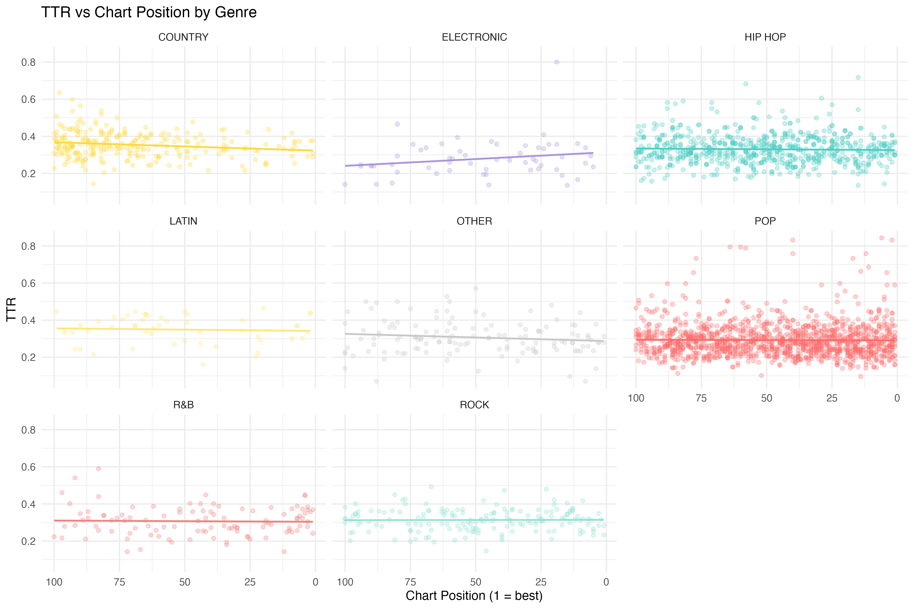

# Lorenzo Garduño

## About Me

Research-focused AI & Robotics graduate now pursuing a Master's degree, with hands-on experience in machine learning, computer vision, and autonomous systems. Strong foundation in Python/C++ programming, deep learning techniques, and embedded systems development. Proven ability to analyze complex datasets and develop innovative solutions for real-world applications.

For more details, see my [CV](Lorenzo_Garduno_Roqueni.pdf).

### Education

| Degree | Institution | Year |
|--------|-------------|------|
| **MSc (Current)** | University of Sheffield | 2025 |
| **BSc Robotics & Artificial Intelligence** | University of Hull | 2022 - 2025 |
| **Foundation in Maths & Physics** | King's College London | 2021 - 2022 |

### Professional Skills

| Category | Skills |
|----------|--------|
| **Programming** | Python, C/C++, R, SQL |
| **Machine Learning** | CNN, GAN, NLP, Sentiment Analysis |
| **Data Analysis** | tidyverse, ggplot2, statistical modeling |
| **Computer Vision** | Image classification, synthetic data generation |
| **Robotics** | ROS, LiDAR, embedded systems, kinematics |

### Languages

- English (Proficient)
- Spanish (Native)

### Contact

- Email: lorenzo@garduno.mx
- LinkedIn: [linkedin.com/in/lorenzo-garduno](https://www.linkedin.com/in/lorenzo-garduno)

---

# IJC437 Project: Lexical Diversity in Billboard Hot 100 Lyrics

## Introduction

This project analyzes the vocabulary characteristics of Billboard Hot 100 songs from 2000 to 2023. Using text mining techniques, I examine whether lyrical complexity correlates with chart success and how vocabulary patterns differ across musical genres. The analysis applies multiple lexical metrics to 3,397 songs to quantify repetition, creativity, and information density in popular music.

## Research Question

**How does lexical diversity in Billboard Hot 100 songs (2000-2023) vary by genre, relate to chart performance, and change over time?**

| Analysis Type | Method |
|---------------|--------|
| Descriptive statistics | Mean, median, distribution of TTR/density by genre |
| Correlation analysis | Spearman's rho (lexical metrics vs chart position) |
| Comparative analysis | Cross-genre metric comparisons |
| Time series analysis | Temporal trends across 24 years |
| Text mining | Tokenization, word frequency, Jaccard similarity |

## Key Findings

### 1. Temporal Trends Vary by Genre

Rather than a uniform trend across all genres, the data reveal divergent patterns. Hip Hop and Electronic show increasing vocabulary diversity over time, while R&B and Rock trend negatively. Pop shows a slight increase, and Country remains stable. This partially contradicts the "dumbing down" narrative reported in prior literature (Parada-Cabaleiro et al., 2024; Varnum et al., 2021). The correlation between TTR and time across all genres is weak (ρ = 0.064), though rare word ratio shows a stronger relationship (ρ = 0.128), suggesting artists may be incorporating more unusual vocabulary over time.



### 2. Substantial Genre Differences

| Genre | n | TTR (mean) | TTR (SD) | Lex. Density | Rare Word | Avg Words |
|-------|---|------------|----------|--------------|-----------|-----------|
| Pop | 1,333 | 0.292 | 0.088 | 0.367 | 0.154 | 500 |
| Hip Hop | 706 | 0.330 | 0.076 | 0.396 | 0.204 | 612 |
| Country | 267 | 0.354 | 0.070 | 0.357 | 0.127 | 334 |
| Rock | 166 | 0.314 | 0.060 | 0.324 | 0.117 | 341 |
| R&B | 107 | 0.307 | 0.078 | 0.329 | 0.124 | 420 |
| Electronic | 58 | 0.280 | 0.101 | 0.363 | 0.129 | 346 |
| Latin | 51 | 0.349 | 0.074 | 0.605 | 0.449 | 473 |

Hip Hop is particularly interesting: despite having the longest average song length (612 words), which would typically lower TTR, it maintains the third-highest mean TTR (0.330) and the highest rare word ratio (0.204). This points to genuinely diverse and creative vocabulary use. Latin shows anomalously high lexical density (0.605) and rare word ratio (0.449)—a methodological artefact where Spanish function words are not captured by the English stop word list.



### 3. No Relationship Between Lexical Complexity and Chart Success

| Metric | ρ | Interpretation |
|--------|---|----------------|
| TTR | 0.090 | Very weak positive |
| Lexical Density | 0.010 | No relationship |
| Rare Word Ratio | -0.003 | No relationship |

All correlations are near zero (|ρ| < 0.1), indicating that lexical complexity metrics do not predict chart success. Songs with simple, repetitive lyrics perform equally as well as those with diverse, creative vocabulary. This suggests commercial success is driven primarily by non-lyrical factors such as melody, production quality, marketing, artist recognition, and playlist placement.



### Metrics Used

| Metric | Formula | What It Measures |
|--------|---------|------------------|
| **Type-Token Ratio (TTR)** | unique words / total words | Vocabulary variety |
| **Lexical Density** | content words / total words | Information density |
| **Rare Word Ratio** | words not in top 10k / unique words | Creative vocabulary |
| **Compression Ratio** | gzip size / original size | Algorithmic repetitiveness |
| **Jaccard Similarity** | intersection / union | Vocabulary overlap with genre/corpus |

## R Code

The analysis is implemented in R using the tidyverse ecosystem. Key notebooks:

| File | Purpose |
|------|---------|
| `wrangling and transformation/wrangling/lexical_diversity_transformation.ipynb` | Data preparation and metric calculation |
| `analysis and vizualisation/analysis/lexical_analysis.ipynb` | Statistical analysis and visualization |

### Core Analysis Code

```r
# Libraries
library(tidyverse)
library(tidytext)
library(ggplot2)

# Load prepared data
df <- read_csv('data/cleaned/billboard_lexical_analysis_ready.csv')

# TTR by genre analysis
df %>%
  group_by(macro_genre) %>%
  summarize(
    avg_ttr = mean(ttr, na.rm = TRUE),
    median_ttr = median(ttr, na.rm = TRUE),
    n = n()
  ) %>%
  arrange(desc(avg_ttr))

# Correlation: TTR vs chart position
cor.test(df$ttr, df$ranking, method = "spearman")

# Visualization: TTR by genre
ggplot(df, aes(x = reorder(macro_genre, ttr, FUN = median), y = ttr)) +
  geom_boxplot(fill = "steelblue", alpha = 0.7) +
  coord_flip() +
  labs(
    title = "Lexical Diversity by Genre",
    x = "Genre",
    y = "Type-Token Ratio (TTR)"
  ) +
  theme_minimal()
```

## Instructions for Downloading and Running

### Prerequisites

- R (version 4.0+)
- RStudio (recommended)

### Step 1: Clone the Repository

```bash
git clone https://github.com/klorine28/datasci-vis.git
cd datasci-vis
```

### Step 2: Install R Packages

```r
# Core packages
install.packages(c("tidyverse", "readr", "stringr", "ggplot2"))

# Text mining
install.packages("tidytext")

# Missing data visualization
install.packages(c("naniar", "visdat"))
```

### Step 3: Run the Analysis

1. Open RStudio
2. Set working directory to the project root
3. Open `analysis and vizualisation/analysis/lexical_analysis.ipynb`
4. Run all cells sequentially

### Data Files Required

| File | Location | Description |
|------|----------|-------------|
| `billboard_lexical_analysis_ready.csv` | `data/cleaned/` | Pre-processed dataset with lexical metrics |
| `common_english_words_10k.csv` | `data/cleaned/` | Reference word list for rare word calculation |

### Output

Results are saved to `outputs/lexical_analysis/`:
- 18 PNG visualization files
- Statistical summaries printed in notebook

## Dataset

| Source | Records | Description |
|--------|---------|-------------|
| Billboard Hot 100 (Kaggle) | 3,397 songs | Chart rankings, lyrics |
| MusicoSet (DSW 2019) | 11,518 artists | Genre classifications |

**Coverage:** 100% lyrics, 85.6% genre data

## Limitations

- Only Billboard Hot 100 songs (mainstream bias)
- Genre assigned at artist level, not song level
- Latin genre inflated on "rare word" metrics (Spanish words)
- Some pre-2010 lyrics had quality issues (564 replaced)

---

**Author:** Lorenzo Garduño
**Course:** IJC437 Data Science and Visualization
**Repository:** [github.com/klorine28/datasci-vis](https://github.com/klorine28/datasci-vis)
