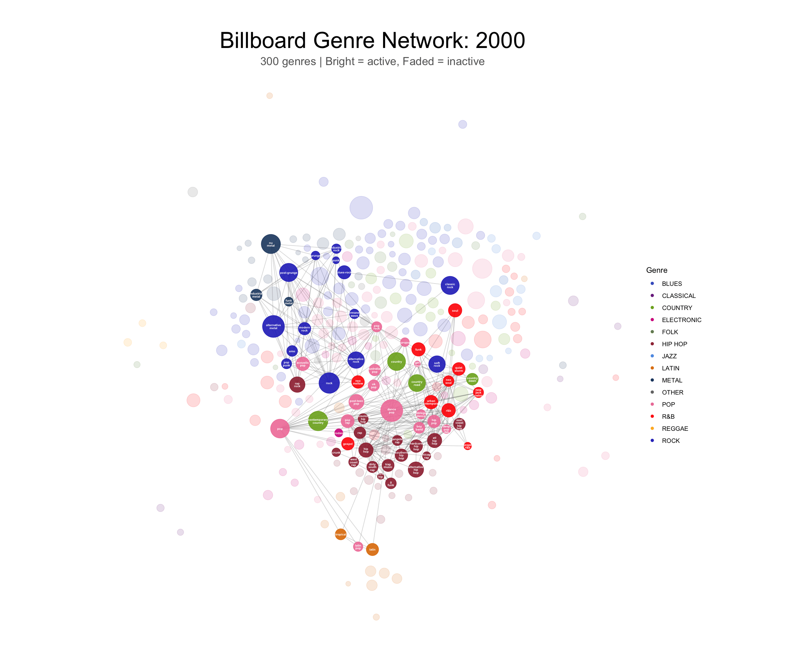

# Lorenzo Garduño

## About Me

Research-focused AI & Robotics graduate now pursuing a Master's degree, with hands-on experience in machine learning, computer vision, and autonomous systems. Strong foundation in Python/C++ programming, deep learning techniques, and embedded systems development. Proven ability to analyze complex datasets and develop innovative solutions for real-world applications.

For more details, see my [CV](Lorenzo_Garduno_Roqueni.pdf).

### Education

| Degree | Institution | Year |
|--------|-------------|------|
| **MSc (Current)** | University of Sheffield | 2025 |
| **BSc Robotics & Artificial Intelligence** | University of Hull | 2022 - 2025 |
| **Foundation in Maths & Physics** | King's College London | 2021 - 2022 |

### Professional Skills

| Category | Skills |
|----------|--------|
| **Programming** | Python, C/C++, R, SQL |
| **Machine Learning** | CNN, GAN, NLP, Sentiment Analysis |
| **Data Analysis** | tidyverse, ggplot2, statistical modeling |
| **Network Analysis** | igraph, ggraph, graph metrics |
| **Robotics** | ROS, LiDAR, embedded systems, kinematics |

### Languages

- English (Proficient)
- Spanish (Native)

### Contact

- Email: lorenzo@garduno.mx
- LinkedIn: [linkedin.com/in/lorenzo-garduno](https://www.linkedin.com/in/lorenzo-garduno)

---

# IJC445 Project: Genre Network Evolution in Billboard Hot 100

## Introduction

This project analyzes how musical genre relationships have evolved on the Billboard Hot 100 from 2000 to 2023. Using network analysis techniques, I construct genre co-occurrence networks where edges represent artists who share multiple genre tags. The analysis reveals shifting genre boundaries, emerging cross-genre collaborations, and the rise of hip-hop as the dominant genre in mainstream music.

## Research Question

**How do genre relationships evolve over time in the Billboard Top 100?**

| Analysis Type | Method |
|---------------|--------|
| Network analysis | Co-occurrence matrix via one-mode projection (G = AᵀA) |
| Graph metrics | Degree centrality, strength, betweenness |
| Temporal analysis | 24 yearly network snapshots with "pop" anchored at center |
| Visualization | Force-directed layout (Fruchterman-Reingold) with collision detection |
| Clustering | Macro genre grouping (16 categories) |

## Key Findings

### 1. Hip-Hop's Rise to Dominance

Hip-hop has overtaken pop as the most connected genre on Billboard. The genre's co-occurrence with other genres increased dramatically, especially with R&B, pop, and electronic music.



### 2. Genre Boundaries Are Blurring

The Sankey diagram shows significant genre flow between the early (2000-2011) and late (2012-2023) Billboard eras. Pop and hip-hop have increasingly merged, while rock and metal have declined in mainstream presence.


### 3. Macro-Genre Shifts Over Time

The stacked area chart reveals:
- **Hip-hop** grew from ~20% to ~35% of genre presence
- **Pop** remained dominant but increasingly hybridized
- **Rock/Metal** declined significantly after 2010
- **Latin** surged in the late 2010s


### Network Statistics

| Metric | Value |
|--------|-------|
| **Nodes** | 957 sub-genres |
| **Edges** | 8,597 co-occurrence connections |
| **Time span** | 24 yearly snapshots (2000-2023) |
| **Macro genres** | 16 categories |

### Hub Genres

Central genres that connect different parts of the network (highest betweenness centrality):

| Genre | Role |
|-------|------|
| **Pop** | Universal connector across all genres |
| **Hip Hop** | Bridge between R&B, electronic, and pop |
| **Dance Pop** | Connects electronic and mainstream |
| **R&B** | Links hip-hop with soul and pop |

## R Code

The analysis is implemented in R using igraph and ggraph. Key notebooks:

| File | Purpose |
|------|---------|
| `wrangling and transformation/wrangling/bigquery_analysis_queries.sql` | Genre co-occurrence queries |
| `analysis and vizualisation/analysis/genre_analysis.ipynb` | Network analysis and visualization |

### Core Analysis Code

```r
# Libraries
library(tidyverse)
library(igraph)
library(ggraph)
library(gganimate)

# Load co-occurrence data
edges_all <- read_csv('data/sql_query_out/QUERY 2_ Genre Co-Occurrence Network (All Time).csv')

# Build network graph
g <- graph_from_data_frame(edges_all, directed = FALSE)

# Calculate centrality metrics
hub_metrics <- tibble(
  genre = V(g)$name,
  degree = degree(g),
  strength = strength(g),
  betweenness = betweenness(g)
) %>%
  arrange(desc(betweenness))

# Network visualization with Fruchterman-Reingold layout
set.seed(42)
layout_fr <- create_layout(g, layout = 'fr')

ggraph(layout_fr) +
  geom_edge_link(aes(alpha = weight), show.legend = FALSE) +
  geom_node_point(aes(size = strength, color = macro_genre)) +
  geom_node_text(aes(label = name), repel = TRUE) +
  theme_void() +
  labs(title = "Genre Co-occurrence Network")
```

### Co-occurrence Calculation (BigQuery)

```sql
-- Genre pairs from shared artists
SELECT
  g1.genre AS genre_1,
  g2.genre AS genre_2,
  COUNT(DISTINCT g1.name) AS co_occurrence_count
FROM artist_genres g1
JOIN artist_genres g2 ON g1.name = g2.name AND g1.genre < g2.genre
JOIN billboard b ON g1.name = b.band_singer
GROUP BY genre_1, genre_2
HAVING co_occurrence_count >= 2
```

## Instructions for Downloading and Running

### Prerequisites

- R (version 4.0+)
- RStudio (recommended)

### Step 1: Clone the Repository

```bash
git clone https://github.com/klorine28/datasci-vis.git
cd datasci-vis
```

### Step 2: Install R Packages

```r
# Core packages
install.packages(c("tidyverse", "readr", "stringr", "ggplot2"))

# Network analysis
install.packages(c("igraph", "ggraph", "GGally"))

# Animation
install.packages("gganimate")

# Sankey diagrams
install.packages("ggalluvial")
```

### Step 3: Run the Analysis

1. Open RStudio
2. Set working directory to the project root
3. Open `analysis and vizualisation/analysis/genre_analysis.ipynb`
4. Run all cells sequentially

### Data Files Required

| File | Location | Description |
|------|----------|-------------|
| `QUERY 2_ Genre Co-Occurrence Network (All Time).csv` | `data/sql_query_out/` | All-time genre pairs |
| `QUERY 4_ Genre Co-Occurrence Network (Yearly).csv` | `data/sql_query_out/` | Yearly genre pairs |
| `genre_macro_mapping.csv` | `data/cleaned/` | Micro to macro genre mapping |
| `supplementary_artist_genres_final.csv` | `data/cleaned/` | Enhanced genre data |

### Output

Results are saved to `outputs/genre_network/`:
- Network visualizations (PNG, GIF)
- Yearly snapshots
- Sankey diagrams
- Hub genre analysis

## Dataset

| Source | Records | Description |
|--------|---------|-------------|
| Billboard Hot 100 (Kaggle) | 3,397 songs | Chart rankings by year |
| MusicoSet (DSW 2019) | 11,518 artists | Genre classifications from Spotify |

**Coverage:** 85.6% of Billboard artists matched to genre data

## Limitations

- MusicoSet dataset from 2019 has coverage gap for newer artists (~40% unmatched post-2019)
- Genre tags assigned at artist level, not song level
- Co-occurrence decline in recent years is a data artifact, not a real trend
- Spotify genre tags vary in granularity across artists

### Data Enhancement

To address the MusicoSet coverage gap:
- Fetched genres via Spotify API for unmatched artists
- Manual assignment for high-frequency artists without Spotify genres
- Enhanced data improves but doesn't fully solve post-2019 coverage

---

**Author:** Lorenzo Garduño
**Course:** IJC445 Data Science and Visualization
**Repository:** [github.com/klorine28/datasci-vis](https://github.com/klorine28/datasci-vis)
